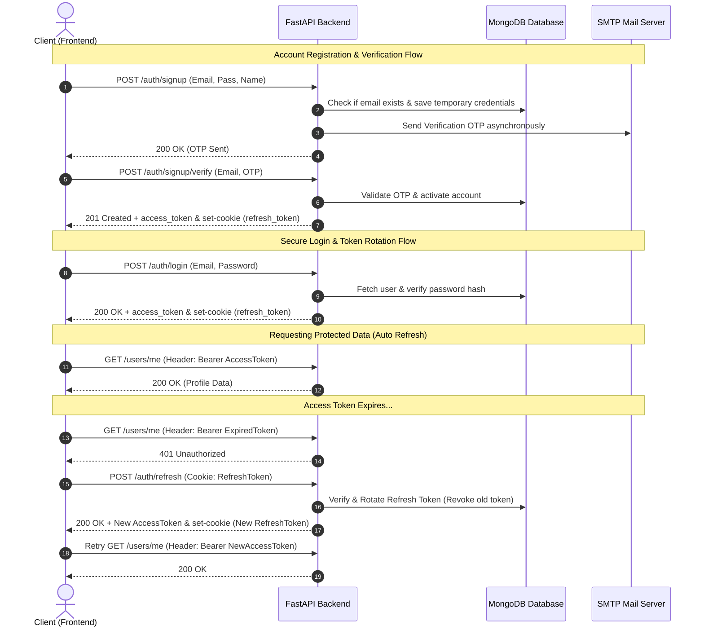

# 🚀 Advanced Fullstack Python Skill (FastAPI + MongoDB + React + GSAP)

[](https://fastapi.tiangolo.com)
[](https://www.mongodb.com)
[](https://react.dev)
[](https://vitejs.dev)
[](https://tailwindcss.com)
[](https://gsap.com)
[](https://jwt.io)
[](https://opensource.org/licenses/MIT)

A production-grade, security-hardened, and design-optimized fullstack web application scaffold. This template provides a robust foundation for building modern web services, integrating enterprise-grade authentication, state management, and immersive user experiences.

---

## 🌟 Key Features

### 🛡️ Security-First Architecture
*   **Brute-Force Protection:** Account lockouts (5 failed attempts trigger a 15-minute cooldown) to mitigate credential stuffing.
*   **Input Sanitization:** XSS protection using HTML sanitization libraries (`bleach`) on all incoming string payloads.
*   **Hardened Headers:** Configured security-oriented middleware injecting `X-Frame-Options: DENY`, `X-Content-Type-Options: nosniff`, and customized CORS policies.
*   **Rate Limiting:** IP-based and route-based rate limit implementation using `SlowAPI` and memory storage.
*   **Safe Sessions:** Constant-time responses for credential checks to prevent timing/user-enumeration attacks.

### 🔑 Authentication & Authorization
*   **Dual-Token JWT Rotation:** Access tokens (15-min expiry) paired with rotating refresh tokens (7-day expiry) stored in HTTP-only/SameSite cookies to mitigate XSS-based token theft.
*   **OTP-Based Verification:** Double-opt-in user registration and verification via asynchronous OTP email transmission.
*   **Google OAuth 2.0:** Single-sign-on integration validating Google ID tokens on the server.
*   **Password Reset Flow:** OTP-verified password resets that automatically revoke all active refresh tokens for the user.
*   **Role-Based Access Control (RBAC):** Strict dependency-injection guards to lock routes down to specific roles (`customer`, `manager`, `admin`).

### 🎨 Premium UI/UX & Interactions (UI/UX Pro Max)
*   **Theme Presets:** Integrated styling configurations including *Luxury Dark* (Obsidian & Gold), *Neon Cyberpunk*, and *Sophisticated Minimalist*.
*   **Dynamic Headings:** Animated character-reveal and block-reveal scroll transitions.
*   **Micro-interactions:** GPU-accelerated magnetic buttons, scale effects, and glassmorphic card overlays.
*   **Smooth Animations:** Memory-safe GSAP integrations utilizing `@gsap/react`'s `useGSAP` hook for trigger-linked and entry timeline animations.
*   **Bento Grid Layouts:** Multi-size grids with subtle glow borders designed for interactive landing pages.

---

## 🛠️ Technology Stack

### Backend
*   **Core Framework:** [FastAPI](https://fastapi.tiangolo.com/) (Asynchronous python web framework)
*   **Database:** MongoDB via [Motor](https://motor.readthedocs.io/) (Async MongoDB driver)
*   **Validation:** [Pydantic v2](https://docs.pydantic.dev/) (Data parsing and validation)
*   **Mail Client:** Asynchronous SMTP integration (`aiosmtplib`)
*   **Storage System:** File and media uploads handling via [Cloudinary](https://cloudinary.com/)
*   **Settings Management:** Pydantic-Settings reading environment configurations

### Frontend
*   **Core Library:** React 18
*   **Build Tooling:** Vite (Fast dev server and bundle pipeline)
*   **Routing:** React Router DOM v6
*   **HTTP Client:** Axios (Armed with interceptors for token refresh handling)
*   **Animation System:** GreenSock Animation Platform (GSAP) & `@gsap/react`
*   **Styling Engine:** Tailwind CSS & custom Vanilla CSS layout rules

---

## 📂 Folder Structure

```text
project-root/
├── backend/
│   ├── main.py                    # FastAPI application setup, CORS, middleware, routers
│   ├── database.py                # Motor client initialization, collection binds, index definitions
│   ├── requirements.txt           # Python backend dependencies
│   ├── .env.example               # Template for environment configuration
│   ├── core/
│   │   ├── config.py              # Configuration schemas reading from .env
│   │   ├── security.py            # Hashing, token payload extraction, OTP verification
│   │   ├── deps.py                # FastAPI dependency injection guards (RBAC, Current User)
│   │   ├── middleware.py          # Security header injections, logging, input sanitizers
│   │   └── email.py               # Async email helpers for OTP delivery
│   ├── models/
│   │   └── schemas.py             # Shared Pydantic data schemas
│   └── routers/
│       ├── auth.py                # Signups, logins, token refresh, OAuth, OTP verifies
│       ├── users.py               # Profile GET/PUT, password changes, account deletions
│       ├── items.py               # Resource CRUD controller
│       ├── admin.py               # Admin dashboard and user privilege controls
│       └── uploads.py             # Cloudinary upload endpoints
├── frontend/
│   ├── index.html                 # Entry HTML template
│   ├── package.json               # Node packages and scripts
│   ├── vite.config.js             # Vite compiler rules
│   ├── tailwind.config.js         # Custom design tokens, typography, colors
│   ├── .env.example               # Template for frontend environment variables
│   └── src/
│       ├── main.jsx               # Application bootstrap
│       ├── App.jsx                # Layout wrapper & client routes
│       ├── api/
│       │   ├── axios.js           # Client HTTP instance with automated token refresh interceptor
│       │   └── endpoints.js       # Client API endpoint integrations
│       ├── context/
│       │   └── AuthContext.jsx    # Authentication state manager (User session, login, logout)
│       ├── hooks/
│       │   └── useAuth.js         # Conveniency hook for authorization checks
│       ├── components/
│       │   ├── ProtectedRoute.jsx # Wrapper locking routes to authenticated users
│       │   ├── AdminRoute.jsx     # Wrapper locking routes to admin role
│       │   ├── Navbar.jsx         # Global header
│       │   ├── Footer.jsx         # Global footer
│       │   └── LoadingSpinner.jsx # UX loading spinner
│       ├── pages/
│       │   ├── Home.jsx           # Landing / Hero page
│       │   ├── Login.jsx          # Login container
│       │   ├── Register.jsx       # Signup container
│       │   ├── VerifyEmail.jsx    # Email OTP validation screen
│       │   ├── ForgotPassword.jsx # Recovery trigger screen
│       │   ├── ResetPassword.jsx  # Recovery change screen
│       │   ├── Dashboard.jsx      # Generic user home
│       │   ├── Profile.jsx        # User configuration portal
│       │   ├── Admin.jsx          # Admin command console
│       │   └── NotFound.jsx       # Fallback 404 page
│       └── styles/
│           └── index.css          # Tailwind imports and base styles
└── docker-compose.yml             # Local multi-container Docker compose manifest
```

---

## 📈 Detailed Session & Auth Flows



---

## ⚙️ Configuration & Environment Variables

Create `.env` files based on the templates in both directories.

### Backend Configurations (`backend/.env`)
| Variable Name | Description | Default / Example |
| :--- | :--- | :--- |
| `MONGODB_URI` | MongoDB Connection String | `mongodb://localhost:27017` |
| `DB_NAME` | Database identifier | `myapp` |
| `JWT_SECRET` | Secret key used to sign Access Tokens | *Generate a secure 32-char string* |
| `JWT_REFRESH_SECRET` | Secret key used to sign Refresh Tokens | *Generate a separate secure string* |
| `JWT_ALGORITHM` | Hashing algorithm used in tokens | `HS256` |
| `ACCESS_TOKEN_EXPIRE_MINUTES` | Lifetime of the access token | `15` |
| `REFRESH_TOKEN_EXPIRE_DAYS` | Lifetime of the refresh token | `7` |
| `CORS_ORIGINS` | Allowlist for frontend access | `http://localhost:5173` |
| `GOOGLE_CLIENT_ID` | Client identifier for OAuth authentication | *From Google Developer Console* |
| `SMTP_HOST` | Host of SMTP email server | `smtp.gmail.com` |
| `SMTP_PORT` | Port of SMTP email server | `587` |
| `SMTP_USER` | Email username for sending alerts/OTP | `sender@gmail.com` |
| `SMTP_PASSWORD` | App-specific password for the email account | *Gmail App Password* |
| `SMTP_FROM_NAME` | Mail sender display name | `ScaffoldApp` |
| `SMTP_FROM_EMAIL` | Mail sender address | `noreply@scaffold.com` |
| `OTP_EXPIRY_MINUTES` | Expiry countdown for validation OTPs | `10` |
| `MAX_LOGIN_ATTEMPTS` | Allowed login failures before lockout | `5` |
| `LOGIN_LOCKOUT_MINUTES` | Lockout penalty duration | `15` |
| `CLOUDINARY_CLOUD_NAME` | Cloudinary Storage cloud name | *From Cloudinary Console* |
| `CLOUDINARY_API_KEY` | Cloudinary API Key | *From Cloudinary Console* |
| `CLOUDINARY_API_SECRET` | Cloudinary API Secret | *From Cloudinary Console* |

### Frontend Configurations (`frontend/.env`)
| Variable Name | Description | Default / Example |
| :--- | :--- | :--- |
| `VITE_API_URL` | Base endpoint of your FastAPI backend | `http://localhost:8000` |
| `VITE_GOOGLE_CLIENT_ID` | OAuth Client identifier matching backend | *From Google Developer Console* |

---

## 🚀 Quick Start

### Prerequisites
*   Python 3.11+
*   Node.js 18+
*   MongoDB Instance (Local or MongoDB Atlas)

### Local Manual Installation

1.  **Clone and Navigate:**
    ```bash
    git clone https://github.com/Parmar-jay/advanced-fullstack-skill.git
    cd advanced-fullstack-skill
    ```

2.  **Spin Up Backend:**
    ```bash
    cd backend
    python -m venv venv
    
    # Windows
    .\venv\Scripts\activate
    # macOS/Linux
    source venv/bin/activate
    
    pip install -r requirements.txt
    cp .env.example .env # Update local credentials inside .env
    uvicorn main:app --reload --port 8000
    ```
    Access the interactive API documentation (Swagger) at [http://localhost:8000/docs](http://localhost:8000/docs).

3.  **Spin Up Frontend:**
    ```bash
    # From project root
    cd frontend
    npm install
    cp .env.example .env # Update local configurations inside .env
    npm run dev
    ```
    Open the application at [http://localhost:5173](http://localhost:5173).

### Local Docker Installation
Build and launch the complete stack containing MongoDB, backend api, and frontend client in a unified container configuration:
```bash
docker-compose up --build
```

---

## 📖 Extension & Development Guidelines

### Adding a New Data Resource (e.g. "Posts")
1.  **Define Schema:** Add Pydantic validation schemas (`PostCreate`, `PostUpdate`, `PostResponse`) to `backend/models/schemas.py`.
2.  **Create Router:** Add `backend/routers/posts.py` implementing endpoints referencing `Depends(get_current_user)` or `Depends(require_role)`.
3.  **Register Router:** Append the newly created route configuration inside `backend/main.py`.
4.  **Database Indexes:** If querying by specific attributes, define indexes in `backend/database.py` inside `create_indexes()`.
5.  **Configure Frontend API:** Register request calls in `frontend/src/api/endpoints.js` using the custom `axios` client instance.
6.  **Create Components:** Structure layouts within `frontend/src/pages/` using custom Tailwind styles.
7.  **Route Setup:** Link screens in `frontend/src/App.jsx`.

### Custom GSAP Mounting Effects
To implement interactive animations safely on React mount without memory leaks, use the `useGSAP` hook:
```jsx
import { useRef } from 'react';
import gsap from 'gsap';
import { useGSAP } from '@gsap/react';

export default function SmoothPanel() {
  const scopeRef = useRef(null);

  useGSAP(() => {
    gsap.from('.fade-item', {
      opacity: 0,
      y: 30,
      stagger: 0.15,
      ease: 'power3.out',
      duration: 1
    });
  }, { scope: scopeRef });

  return (
    <div ref={scopeRef} className="bg-obsidian-950 p-8">
      <div className="fade-item text-gold font-display text-4xl">Immersive Landing Item</div>
      <p className="fade-item text-stone-300">Clean staggered entry transitions.</p>
    </div>
  );
}
```

---

## 📄 License

Distributed under the MIT License. See [LICENSE](./LICENSE) for details.
